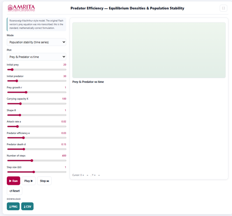
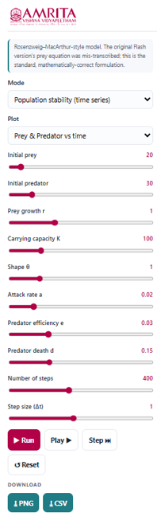
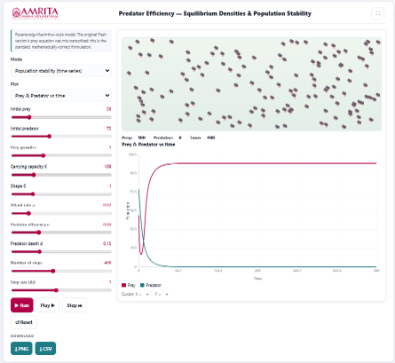

### Procedure

1. The simulator enables users to investigate how predator efficiency, prey carrying capacity, and other ecological parameters influence the equilibrium densities and long-term stability of predator–prey populations. Users can configure the simulation parameters, execute the model, and analyze the effects of predator efficiency on population dynamics using different visualization modes.

 
&nbsp;

2. The simulator consists of a parameter panel on the left and a visualization panel on the right for displaying the selected graphical output.

 
&nbsp;

3. Read the introductory information displayed at the top of the parameter panel. This section briefly describes the Rosenzweig–MacArthur predator–prey model used in the simulator and indicates that it provides a mathematically corrected implementation for analyzing predator–prey dynamics.
 
&nbsp;

4. Select the desired simulation mode from the Mode drop-down menu. The simulator provides different analysis modes, such as Population stability (time series) and other available options for investigating equilibrium densities and predator–prey stability.
 
&nbsp;

5. Select the required graphical output from the Plot drop-down menu. The simulator provides different graphical representations of predator–prey dynamics depending on the selected mode.
 
&nbsp;

6. Specify the initial prey population using the Initial prey slider. This parameter defines the number of prey individuals present at the beginning of the simulation.
 
&nbsp;

7. Specify the initial predator population using the Initial predator slider. This parameter defines the initial number of predator individuals in the ecosystem.
 
&nbsp;

8. Adjust the intrinsic prey growth rate (r) using the corresponding slider. This parameter determines the rate at which the prey population increases in the absence of predation.
 
&nbsp;

9. Specify the prey carrying capacity (K) using the Carrying capacity slider. This parameter represents the maximum prey population that the environment can sustainably support.
 
&nbsp;

10. Adjust the shape parameter (θ) using the corresponding slider. This parameter modifies the characteristics of prey population growth as it approaches the carrying capacity.
 
&nbsp;

11. Adjust the predator attack rate (a) using the corresponding slider. This parameter determines the efficiency with which predators encounter and capture prey.
 
&nbsp;

12. Specify the predator efficiency (e) using the corresponding slider. This parameter represents the efficiency with which consumed prey biomass is converted into predator population growth.
 
&nbsp;

13. Adjust the predator death rate (d) using the corresponding slider. This parameter defines the natural mortality rate of the predator population.
 
&nbsp;

14. Set the total number of simulation steps using the Number of steps slider. This parameter determines the duration of the simulation and the number of computational iterations.
 
&nbsp;

15. Adjust the simulation step size (Δt) using the Step size (Δt) slider. This parameter specifies the numerical time interval used for solving the model equations. Smaller values generally improve simulation accuracy and numerical stability.
 
&nbsp;

16. After configuring all simulation parameters, click the Run button to execute the simulation and generate the selected graphical output.

 
&nbsp;

17. Alternatively, click the Play button to visualize the simulation continuously or click the Step button to advance the simulation one time step at a time for detailed observation of predator–prey interactions.
 
&nbsp;

18. Observe the animation panel displayed above the graph. The animation provides a visual representation of the prey and predator populations throughout the simulation.
 
&nbsp;

19. Monitor the population counters displayed below the animation panel to observe the current prey population, predator population, and simulation time during each stage of the simulation.
 
&nbsp;

20. Examine the graph displayed in the visualization panel. The graph illustrates the temporal variation in prey and predator populations under the selected simulation mode.
 
&nbsp;

21. Interpret the X-axis (Time) to determine the progression of the simulation and the Y-axis (Population) to examine changes in the sizes of the prey and predator populations.
 
&nbsp;

22. Use the graph legend to distinguish between the Prey and Predator population curves.
 
&nbsp;

23. Observe the population trajectories to identify the initial transient phase, periods of population growth or decline, and the eventual approach toward equilibrium, sustained oscillations, or predator extinction depending on the selected parameter values.
 
&nbsp;

24. Compare the prey and predator curves to evaluate how changes in prey abundance influence predator population dynamics and how predator efficiency affects the long-term stability of the ecosystem.
 
&nbsp;

25. Modify one or more simulation parameters, such as predator efficiency, attack rate, carrying capacity, prey growth rate, or predator death rate, and execute the simulation again to investigate their influence on equilibrium densities and population stability.
 
&nbsp;

26. Compare the simulation results obtained under different parameter combinations to determine the ecological conditions that promote stable coexistence, oscillatory dynamics, or collapse of the predator population.
 
&nbsp;

27. If required, click the Reset button to restore the default simulation parameters before performing another simulation.
 
&nbsp;

28. Download the graphical output by clicking the PNG button or export the numerical simulation data by clicking the CSV button for further quantitative analysis and comparison.
 
&nbsp;

29. Repeat the above procedure using different simulation modes and ecological parameter combinations to compare equilibrium densities, population trajectories, and the influence of predator efficiency on the long-term stability of predator–prey systems.
 
&nbsp;

