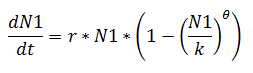
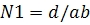
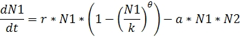
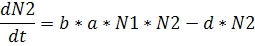

**Predator Efficiency:** The number of encounters that a predator had made which resulted in successful kills of the prey.

**Zero population growth rate:** The rate at which number of births=number of deaths which means that the population is at equilibrium state.

**Carrying capacity:** The maximum number of individuals that a population can support.

**Crowding:** The population will be at a very high density after a certain period of growth. When crowding happens, the rate of growth per individual decreases, possibly due to the restricted food supply, etc. When there is no or less crowding, it means that very few individuals exist, where the rate of growth will be at a very high rate.

&nbsp;

**Logistic Population Growth:** Population growth with a carrying capacity. (Logistic means to calculate or to predict from an equation)
Predation is a process that involves interactions between prey defences and the foraging tactics of predators. Prey items (species, age class and quality) are assumed to exist in patches and it is also assumed that these patches differ in prey density or quality. The forager (predator) exploits and chooses patches in a manner that maximises energy intake or maximises its prey encounter rate. The success rate in the killing of the prey depends on the efficacy of the predator. The more efficient the predator, the more easy way they hunt down the prey. Organisms that experience high mortality compensate by producing lots of young. For this fundamental reason, most population ecologists believe that most populations are stabilized by factors that are called density dependent. Such factors influence birth rates or death rates in a way that varies systematically with density, such that populations converge to densities at which rates of birth and death are equal and the density is at equilibrium. Such factors act as a negative feedback system that is analogous to the regulation of room temperature by a thermostat. If densities rise above the equilibrium value, the death rate exceeds the birth rate and the population returns to equilibrium. If densities fall below the equilibrium value, the birth rate exceeds the death rate and the population increases.

To understand the effect of predator efficiency on equilibrium densities using logistic growth equation (continuous): There are various types of predator-prey interactions in this nature and here we mainly focus on ratio dependent predation. This type of predation indicates that the consumption rate depends on the ratio of prey to predators, and a particular ratio needs to be exceeded for the predators to increase in abundance. Keeping this type of interaction in mind, we try to observe the effects of predator efficiency on the equilibrium densities which have quite a prominent role. 

Consider a situation, where hawks are predators and its prey is swallows. Hawks hunt down swallows and the swallows try to add new individuals to its population at the same rate as they are hunted down so as to maintain constant density (equilibrium). For a population to remain at constant density, the birthrate must equal death rate. Each individual must on average replace itself with one surviving offspring. Indeed, for any species to persist over evolutionary time, the average birthrate must equal the average death rate, although these quantities may vary considerably from year to year. 

&nbsp;

In this case, as soon as the swallows add individuals to the population, the hawk should be able to remove them to maintain constant density of the prey population. In addition to that, another important factor in the growth of the prey population to be considered is crowding. If crowding is less, the rate of growth per individual is high which leads to the increase in the number of individuals getting added to the prey population as only very few individuals exist. On the other hand, when crowding is high which happens mostly at carrying capacity, lead to the decreased rate of growth in individual which means that the number of individuals getting added to the population decreases. We use the classical logistic growth model to predict the growth of the prey population.

 
&nbsp;

Where, **N1** is the prey population,

**r** is the rate of growth of the prey population,

**k** is the carrying capacity,

**θ** is the relation between actual rate of growth per individual and population density.

&nbsp;

The logistic growth equation used for the prey population results in a graph where the density of the prey increases and peaks at half the carrying capacity which is a typical characteristic of a population when theta (θ) is equal to 1. It is because at that density (lower density) the population grows at a very fast pace as there will be too few individuals but at higher densities the rate of growth per individual is depressed by crowding so the rate at which new swallows added to the population decreases.

Under such conditions, when the predator is relatively inefficient, i.e., when many prey are needed to maintain a population of predators, the equilibrium prey abundance is not much less than the equilibrium in the absence of predators. By contrast, when the predators are more efficient equilibrium density of predator is higher but the interaction is less stable. Moreover if the predators are very strongly self-limited, then abundance may not oscillate at all but equilibrium density of predator is lower while equilibrium density of prey will tend to be not much less than carrying capacity. Hence, for interactions where there is crowding, there appears to be a contrast between those in which predator density is low, prey abundance is little affected and the patterns of abundance are stable, and those in which predator density is higher and prey abundance is more drastically reduced, but the patterns of abundance are less stable.

**To analyze the effect on equilibrium densities of predator and prey populations by varying the predator efficiency** ("Encounters result in kill of the prey" parameter in the simulator): 

For observing the above mentioned changes on the equilibrium densities of predator and prey populations while varying predator efficiency, we use the following equation;

Where, **N1** is the prey population,

**d** is the death rate of the predator,

**a** is the predator efficiency (variable parameter), and

**b** is the consumption rate of the predator.
 

This equation is used to calculate the zero population growth of the predator. In order to know what happens to the equilibrium densities of the predator and prey, this equation is used. Using this equation, the points where the predator has zero population growth are plotted on the graph. The same equation is used for different predator efficacies as only the parameter 'a' will change and the obtained value is the corresponding zero population growth rate of the predator.

The point at which the line representing zero population growth rate of predator and prey population growth curve intersects denotes the constant density of swallows (prey density).

&nbsp;

**To understand the effect of predator efficiency on population stability using established Mathematical model of Lotka-Volterra Equations.**

 

Every population need to maintain stability which otherwise leads the system to chaos. Considering the above predator-prey interaction, population stability of that system is also affected by varying predator efficiency as it is ratio dependent predation. When the predator efficiency is high, the equilibrium density of the predator is high whereas the equilibrium density of the prey is low, which leads the system to be highly unstable as they hunt down more number of prey leading to the decrease in the density of the prey population. When prey population decreases, there will be insufficient food and the rate of growth per individual of the predator decreases which leads to instability. And the system becomes highly stable when the predator efficiency is very low and becomes moderately stable when the predator efficiency is at an average level. The variation is studied using the Lotka-Volterra equations.

where, **N1** is prey population growth,

**N2** is predator population growth,

**r** is the rate of growth of the prey population,

**k** is the carrying capacity of the prey population,

**a** is the predator efficiency,

**b** is the consumption rate of the predator,

**d** is the death rate of the predator.

The first equation is for prey population growth, second equation is for predator population growth. Lower the efficiency of the predator, greater the stability will be.

&nbsp;

**To analyze the effect of the predator efficiency on stability of the interaction, by changing critical parameters like "Encounters result in kill of the prey".**

 

In order to know how the predator efficiency effects population stability, parameter "Encounters result in kill of the prey" need to be changed in the simulator. The values for this parameter can be increased and decreased to see what would be the effect on population stability and also to test the above mentioned hypothesis.